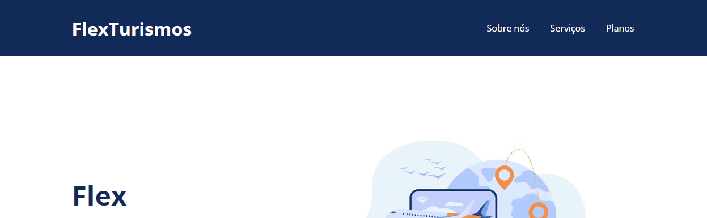

<h1 align="center"> Flex Turismo </h1>

<h3>Descrição do Projeto</h3>

Projeto desenvolvido para aplicação dos conceitos de Flex-box do CSS, do Bootcamp da DIO.

 

Veja o funcionamento da aplicação acessando [aqui]().

 ### 🛠️ Tecnologias
  <h4>
    Front-end
  </h4>
  
  <ul>
    <li>  <strong> HTML5 </strong> </li>
    <li>  <strong> CSS3 </strong> </li>
  </ul>

---
☑️ Licença
[MIT](LICENSE)

---

 Made with 💜 by JANAINA RIBEIRO ✌️ [See my LinkedIn](https://www.linkedin.com/in/janaina-ribeiro-9624044b/)
